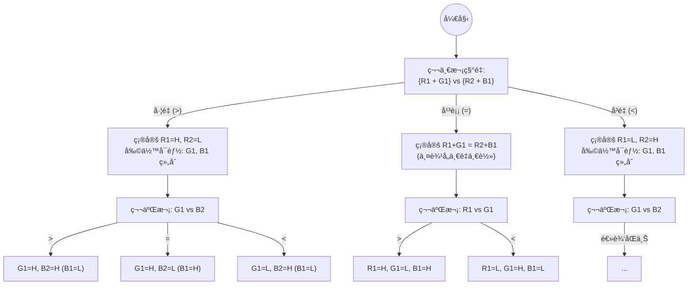
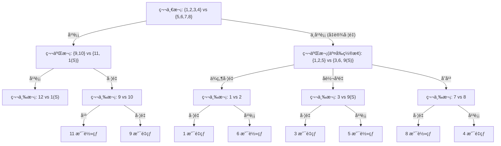

# 第二章 论è¯çš„分æ

## 2.1-2.4论è¯çš„é‡å¡‘/论è¯çš„图示/å¤æ‚的论è¯æ€§è¯­æ®µ/æ¨ç†ä¸­çš„问题

这一整章主è¦å°±æ˜¯åšé¢˜ã€‚分æ日常语言中的论述逻辑，å¤æ‚且长段的语å¥å¯èƒ½éœ€è¦å›¾ç¤ºæ¥æ˜¾å¾—更为清晰。（æ€ä¹ˆè¿™ä¹ˆæ„Ÿè§‰åƒè‹±è¯­é˜…读题目🤣）

我基本åšå®Œäº†è¿™äº›ç»ƒä¹ é¢˜ï¼ŒèŠ±äº†å¾ˆé•¿çš„时间。这里给出一些题目，以åŠæˆ‘个人的分æå’ŒGeminiè€å¸ˆçš„批改。

------

### 逻辑学练习：论è¯é‡å¡‘ (Paraphrasing) 汇总笔记

> **学习目标**：剥离修è¾å¹²æ‰°ï¼Œæå–核心å‰æ (Premises) ä¸ç»“论 (Conclusion)，识别逻辑形å¼ã€‚

------

#### 案例 1：大学教育ä¸å†™ä½œ

åŸæ–‡ï¼š

最近毕业的大学生中有æˆåƒä¸Šä¸‡çš„人无法用书é¢è¯­è¨€è¡¨è¾¾è‡ªå·±ï¼Œè¿™æ˜¯ä¸ºä»€ä¹ˆï¼Ÿå› ä¸ºå¤§å­¦åœ¨å†™ä½œè¯¾ç¨‹çš„å义下æ供给他们的是奇怪的文学ç†è®ºã€é©¬å…‹æ€ä¸»ä¹‰ã€å¥³æ€§ä¸»ä¹‰ã€è§£æ„主义和其他怪异的ç†è®ºã€‚大学欺骗了这些学生。

用户的é‡å¡‘：

大学教的是奇怪的ç†è®ºï¼Œå¥‡æ€ªçš„ç†è®ºæ²¡æœ‰æ•™å¤§å­¦ç”Ÿå¦‚何书é¢è¡¨è¾¾è‡ªå·±ï¼Œæ‰€ä»¥å¤§å­¦ç”Ÿæ— æ³•ç”¨ä¹¦é¢è¯­è¨€è¡¨è¾¾è‡ªå·±ã€‚

**Gemini 的批改：**

- **判定**：找错了结论。
- **核心逻辑**：
  - **P1**：大学生无法表达自己（事å®ï¼‰ã€‚
  - **P2**：大学ä¸æ•™å†™ä½œè€Œæ•™å¥‡æ€ªç†è®ºï¼ˆåŸå› ï¼‰ã€‚
  - **C**：大学**欺骗**了这些学生（价值判断/结论）。
- **è¦ç‚¹**：结论通常是作者最想表达的观点（往往是带有情感或é“德评价的断言），而ä¸ä»…仅是因æœè§£é‡Šã€‚

------

#### 案例 2：ç§æ—多元ä¸ç¦åˆ©å›½å®¶

åŸæ–‡ï¼š

ç§æ—多元的政府常常比å•ä¸€ç§æ—的政府拥有更ä½çš„社会支æŒï¼Œå½“人们因为ç§æ—而被划分的时候，他们就ä¸ä¼šè§‰å¾—是和其他人紧密è”系在一起的，也就ä¸å¤ªä¼šç›¸ä¿¡äº’助程åºã€‚è¦ä¹ˆæ‹¥æœ‰å¤šæ ·æ€§ï¼Œè¦ä¹ˆæ‹¥æœ‰å·¨å¤§çš„ç¦åˆ©ï¼Œæƒ³è¦åœ¨åŒä¸€ä¸ªæ”¿åºœä¸­äº«å—这两者å´å¾ˆéš¾ã€‚

用户的é‡å¡‘：

ç§æ—多元的政府其社会ç¦åˆ©ä½ï¼Œè€Œç§æ—å•ä¸€çš„政府其社会ç¦åˆ©é«˜ï¼Œä¸€ä¸ªæ”¿åºœè¦ä¹ˆæ˜¯ç§æ—多元的，è¦ä¹ˆæ˜¯ç§æ—å•ä¸€çš„，所以一个政府ä¸å¯èƒ½åŒæ—¶æ‹¥æœ‰å¤šæ ·æ€§å’Œé«˜ç¦åˆ©ã€‚

**Gemini 的批改：**

- **判定**：翻译ç†è§£å差，简化了论è¯é“¾æ¡ã€‚
- **核心逻辑**：
  - **P1**：多元化导致人们缺ä¹ç´§å¯†è”系感和互信（社会支æŒåº¦ä½ï¼‰ã€‚
  - **P2**（éšå«å‰æ）：高ç¦åˆ©ç³»ç»Ÿä¾èµ–äºé«˜äº’信和社会支æŒã€‚
  - **C**：多样性ä¸å¤§ç¦åˆ©éš¾ä»¥å…±å­˜ã€‚
- **è¦ç‚¹**：åŸæ–‡çš„ "Social Support" 是指人际互信，而éç¦åˆ©é‡‘。é‡å¡‘应ä¿ç•™â€œä¸ºä»€ä¹ˆâ€éš¾ä»¥å…±å­˜çš„å› æœé“¾æ¡ã€‚

------

#### 案例 3：自由ä¸äººç±»å†å²ï¼ˆå¦å®šå件å¼ï¼‰

åŸæ–‡ï¼š

奥兰多·帕特森认为：“自由是人类处境的一个自然组æˆéƒ¨åˆ†â€ï¼Œäº‹å®å´å¹¶é如此。如æœå¥¥å…°å¤šçš„观点是正确的，我们就有望å‘ç°é布äºæ•´ä¸ªäººç±»å†å²çš„自由社会。但我们没有找到，å而，我们å‘ç°çš„是自å¤ä»¥æ¥å½¢è‰²å„样的专制政府。

用户的é‡å¡‘：

如æœè‡ªç”±æ˜¯äººç±»å¤„境的一个自然组æˆéƒ¨åˆ†ï¼Œé‚£ä¹ˆæˆ‘们就有望å‘ç°é布äºæ•´ä¸ªäººç±»å†å²çš„自由社会。但是我们没有找到，å而，我们å‘ç°çš„是自å¤ä»¥æ¥å½¢è‰²å„样的专制政府，所以自由ä¸æ˜¯äººç±»å¤„境的一个自然组æˆéƒ¨åˆ†ã€‚

**Gemini 的批改：**

- **判定**：é‡å¡‘满分，逻辑命å错误。
- **逻辑形å¼**：**å¦å®šåä»¶å¼ (Modus Tollens)**。
  - å¦‚æœ $P$ 则 $Q$ï¼›é $Q$；所以é $P$。
- **è¦ç‚¹**：å¦å®šâ€œå¦‚æœâ€åé¢çš„部分å«å¦å®šå‰ä»¶ï¼Œå¦å®šâ€œé‚£ä¹ˆâ€åé¢çš„部分å«å¦å®šå件。这是一个有效的论è¯ã€‚

------

#### 案例 4：未æ¥ä¿¡å·è®ºè¯

åŸæ–‡ï¼š

显然，未æ¥ç§‘学家永远无法在时间中å›æº¯åœ°å‘é€ä¿¡å·ã€‚试想，如æœä»–们能这么åšåˆ°çš„è¯ï¼Œæˆ‘们ç°åœ¨ä¸æ˜¯åº”该已ç»æ¥æ”¶åˆ°ä»–们的信æ¯äº†å—？

用户的é‡å¡‘：

如æœç§‘学家能够å‘过å»å‘é€ä¿¡å·ï¼Œé‚£ä¹ˆæˆ‘们能够收到未æ¥ç§‘学家的信æ¯ã€‚但是我们没有收到，所以科学家ä¸èƒ½å‘过å»å‘é€ä¿¡å·ã€‚

**Gemini 的批改：**

- **判定**：完全正确。
- **逻辑形å¼**：**å¦å®šåä»¶å¼ (Modus Tollens)**。
- **è¦ç‚¹**：æˆåŠŸå®ç°äº†â€œå»ä¿®è¾åŒ–â€ï¼Œå°†åé—®å¥è½¬åŒ–为逻辑上的å¦å®šå‰æ（$\neg Q$）。

------

#### 案例 5：æ•é²¸è¡Œä¸ºçš„类比

åŸæ–‡ï¼š

（克里斯托夫将因纽特人æ•é²¸ä¸æ—¥ã€æŒªã€å†°ç­‰å›½æ•é²¸ç­‰åŒè§†ä¹‹ï¼‰â€¦â€¦å› çº½ç‰¹äººæ‰€é¢ä¸´çš„æ¶åŠ£ç”Ÿå­˜ç¯å¢ƒå†³å®šäº†ä»–们的日常饮食……日本以åŠæ¬§æ´²æ•é²¸å›½å®¶çš„人们å¯ä»¥é€‰æ‹©æ‰€æ‘„å–的食物……

用户的é‡å¡‘：

因纽特人因为生存需è¦ä¸å¾—ä¸æ•æ€é²¸é±¼ï¼Œæ—¥æœ¬äººç­‰æ•æ€é²¸é±¼å´æ²¡æœ‰å……足的ç†ç”±ï¼Œæ‰€ä»¥è¿™ä¸¤ç§æ•æ€é²¸é±¼çš„行为有本质区别，ä¸èƒ½ç­‰åŒè§†ä¹‹ã€‚

**Gemini 的批改：**

- **判定**：完全正确，æ•æ‰åˆ°äº†â€œé¶å­â€è§‚点。
- **核心逻辑**：**å驳类比 (Refuting an Analogy)**。
  - 区分了“生存必然性 (Necessity)â€ä¸â€œé€‰æ‹©è‡ªç”± (Choice)â€ã€‚
- **è¦ç‚¹**：识别出作者是通过指出“关键å±æ€§ï¼ˆæ˜¯å¦å¯é€‰ï¼‰â€çš„ä¸åŒæ¥å¦å®šåŸæœ‰çš„类比。

------

#### 案例 6：无é™å®‡å®™ä¸ä»–者

åŸæ–‡ï¼š

太空中所包å«çš„åŸå­æ˜¯ä¸å¯æ•°çš„，促使它们散å‘å„处的力……也是ä¸å¯æ•°çš„。所以我们必须认识到在宇宙的æŸå¤„存在å¦å¤–的世界，那里有ä¸åŒçš„人类和动物。

用户的é‡å¡‘：

åŸå­æ˜¯ä¸å¯æ•°çš„，驱使他们散å‘å„处的力也是ä¸å¯æ•°çš„，所以åŸå­æ— å¤„ä¸åœ¨ï¼Œæˆ‘们这里有åŸå­ï¼ˆç»„æˆäººç±»å’ŒåŠ¨ç‰©ï¼‰ï¼Œæ‰€ä»¥åœ¨å…¶ä»–的地方也会有åŸå­ï¼ˆç»„æˆäººç±»å’ŒåŠ¨ç‰©ï¼‰ã€‚

**Gemini 的批改：**

- **判定**：抓ä½äº†ç›´è§‰ï¼Œè¡¥å…¨äº†éšå«å‰æ。
- **核心逻辑**：**归纳/类比论è¯**（基äºæ¦‚ç‡çš„平庸åŸç†ï¼‰ã€‚
  - **P**：æ„æˆç”Ÿå‘½æ‰€éœ€çš„åŸæ料和力é‡åœ¨å®‡å®™ä¸­æ˜¯æ— é™ä¸”å‡åŒ€åˆ†å¸ƒçš„。
  - **C**：相åŒçš„结æœï¼ˆç”Ÿå‘½/世界）必然在其他地方出ç°ã€‚

------

#### 案例 7：ç§æ—问题的僵局

åŸæ–‡ï¼š

我们总是被民æ—å’Œç§æ—问题困扰。但是é¢ä¸´è¿™äº›é—®é¢˜çš„时候我们往往闭目å¡å¬â€¦â€¦æ‘†å‡ºç½®èº«äº‹å¤–çš„æ¶åŠ¿ã€‚这样，错误的总是对方。

用户的é‡å¡‘：

é¢ä¸´ç§æ—问题的时候，å„个ç§æ—往往都闭目å¡å¬ï¼Œç½®èº«äº‹å¤–。这样，错误的总是对方。而自身没有改å˜ã€‚所有ç§æ—都没改å˜ï¼Œæ‰€ä»¥æˆ‘们会一直被民æ—å’Œç§æ—问题困扰。

**Gemini 的批改：**

- **判定**：基本正确，补全了“因æœå¾ªç¯â€é€»è¾‘。
- **核心逻辑**：**僵局论è¯/æ¶æ€§å¾ªç¯è§£é‡Š**。
  - å‰æ是å„方的心ç†æ€åº¦ï¼ˆé—­ç›®å¡å¬/互æ¨è´£ä»»ï¼‰ï¼Œç»“论是ç°è±¡çš„æŒç»­æ€§ã€‚

------

**学习笔记总结：**

1. **å»ä¿®è¾åŒ–**：把åé—®ã€æ„Ÿå¹è½¬ä¸ºé™ˆè¿°ã€‚
2. **找准结论**：结论是作者最想让你æ¥å—的那个断言。
3. **区分真ç†ä¸æœ‰æ•ˆæ€§**：é‡å¡‘åªçœ‹é€»è¾‘结æ„是å¦ç´§å¯†ã€‚
4. **注æ„指示è¯**：因为/所以（由äº/因此）是é‡å¡‘的生命线。

### 逻辑学练习：论è¯å›¾ç¤ºç¬”è®°

#### 🛠 符å·è¯´æ˜

- **$A \rightarrow B$**：命题 A 是命题 B çš„å‰æ（支撑关系）。
- **$\{A + B\} \rightarrow C$**：ååŒæ”¯æŒï¼ˆLinked），A ä¸ B 必须结åˆæ‰èƒ½æ¨å¯¼å‡º C。
- **$A \rightarrow C; B \rightarrow C$**：独立支æŒï¼ˆConvergent），A å’Œ B åˆ†åˆ«ç‹¬ç«‹æ”¯æŒ C。
- **$A \rightarrow B \rightarrow C$**：串行论è¯ï¼ˆSerial），B 既是 A 的结论，åˆæ˜¯ C çš„å‰æ。

------

ä¸€ã€ ä¸²è¡Œè®ºè¯ (Serial Argument)

这类论è¯çš„特点是ç¯ç¯ç›¸æ‰£ï¼Œé€»è¾‘呈线性递进。

#### 1. 伊斯兰æ镇区图书馆过滤程åº

- **åŸæ–‡**：无论如何，①ã€å›¾ä¹¦é¦†è®¡ç®—机上必须拥有过滤程åºã€‘。②ã€è‰²æƒ…作å“在任何层é¢éƒ½æ˜¯ç¤¾ä¼šçš„ç¾éš¾ã€‘。③ã€æˆ‘们的公共图书馆ç»ä¸èƒ½è¢«ç”¨æ¥ä¼ é€è¿™äº›æ±¡ç§½çš„东西】。
- **你的解法**：$2 \rightarrow 3 \rightarrow 1$
- **Gemini 批改**：**正确**。ä»æ™®é社会判断 (2) 到特定场所åŸåˆ™ (3)，å†åˆ°å…·ä½“执行手段 (1)。

#### 2. 婚姻的社会责任

- **åŸæ–‡**：①ã€å·²å©šè€…比独身者å„æ–¹é¢æ›´å¥åº·ç¨³å®šã€‘。因此 â‘¡ã€å©šå§»æ˜¯ä¸€ç§è´Ÿè´£ä»»çš„社会行为】。③ã€åœ¨ç¨æ”¶æ³•è§„里必须贯彻支æŒå©šå§»çš„åŸåˆ™ã€‘。
- **你的解法**：$1 \rightarrow 2 \rightarrow 3$
- **Gemini 批改**：**正确**。事å®è¯æ® (1) $\rightarrow$ 性质判定 (2) $\rightarrow$ 政策建议 (3)。

#### 3. 欧元ä¸è‹±å›½é¢†å¯¼åŠ›

- **åŸæ–‡**：①ã€æ议采用欧元】。②ã€æˆ‘们是欧洲的一部分，深å—å½±å“】。因此 â‘¢ã€ä¸ºäº†ä½¿æ¬§æ´²å‘期望方å‘转å˜ï¼Œæˆ‘们应该执行领导力】。
- **你的解法**：$2 \rightarrow 3 \rightarrow 1$
- **Gemini 批改**：**正确**。事å®èƒŒæ™¯ (2) $\rightarrow$ 战略必è¦æ€§ (3) $\rightarrow$ 具体æ“作方案 (1)。

#### 4. 日本æ•é²¸ä¸ç»æµå­¦

- **åŸæ–‡**：①ã€æ•é²¸æ¶ˆå¤±ä¸åŠ¨ç‰©é«˜è´µæ— å…³ï¼Œä¸ç»æµå­¦åŸç†æœ‰å…³ã€‘。②ã€è°ƒæŸ¥æ˜¾ç¤ºæ少数人åƒé²¸é±¼è‚‰ã€‘。③ã€ä¸æ„¿åƒå°±ä¸æ„¿ä¹°ã€‘。④ã€ä¸ä¹°åˆ™æ—¥æœ¬å°†å‘Šåˆ«æ•é²¸ä¸šã€‘。
- **你的解法**：$2 \rightarrow 3 \rightarrow 4 \rightarrow 1$
- **Gemini 批改**：**正确**ã€‚æ¶ˆè´¹å¿ƒç† (2) $\rightarrow$ 市场行为 (3) $\rightarrow$ äº§ä¸šç»“æœ (4) $\rightarrow$ 归纳结论 (1)。

------

二〠独立/æ”¶æ•›è®ºè¯ (Convergent Argument)

这类论è¯æ供多个互ä¸ä¾èµ–çš„ç†ç”±æ¥æ”¯æŒåŒä¸€ä¸ªç»“论。

#### 5. æ—登·约翰逊总统评价

- **åŸæ–‡**：①ã€çº¦ç¿°é€Šæ˜¯æœ€æ°å‡ºçš„总统之一】。②ã€ä¸ºæ°‘æ—正义åšå‡ºè´¡çŒ®ã€‘。③ã€ä¸ºç¤¾ä¼šä¿éšœåšå‡ºè´¡çŒ®ã€‘。④ã€æœ€å¯ŒæŠ±è´Ÿçš„æ€æƒ³å®¶ã€‘。（以åŠå…¶ä»–功绩）
- **你的解法**：$\{2+3+4\} \rightarrow 1$
- **Gemini 批改**：**建议修改为独立支æŒ**。$2 \rightarrow 1; 3 \rightarrow 1; 4 \rightarrow 1$。因为æ¯ä¸€é¡¹åŠŸç»©éƒ½è¶³ä»¥å•ç‹¬æ”¯æ’‘其“æ°å‡ºâ€çš„评价。

#### 6. 谴责贫富差è·çš„ç†ç”±

- **åŸæ–‡**：①ã€è¦è°´è´£è´«å¯Œå·®è·ã€‘。②ã€å¯¼è‡´æ”¿æ²»ä¸ç¨³å®šã€‘。③ã€ä¸çŠ¯ç½ªç›¸å…³ã€‘。④ã€ä¸å¯¿å‘½ç¼©çŸ­ç›¸å…³ã€‘。⑤ã€ä¸å…¬æ­£/æ— é“å¾·è¯æ˜ã€‘。
- **你的解法**：$\{2+3+4+5\} \rightarrow 1$
- **Gemini 批改**：**建议修改为独立支æŒ**。$2 \rightarrow 1; 3 \rightarrow 1; 4 \rightarrow 1; 5 \rightarrow 1$。这是典å‹çš„ä»å¤šä¸ªç»´åº¦ï¼ˆæ”¿æ²»ã€æ²»å®‰ã€ç”Ÿç†ã€é“德）独立堆å è¯æ®ã€‚

#### 7. 战争ä¸é—®é¢˜ (å驳å‹)

- **åŸæ–‡**：①ã€æˆ˜äº‰åˆ›é€ é—®é¢˜ä½†ä¸è§£å†³é—®é¢˜ã€‘。②ã€äºŒæˆ˜è§£å†³äº†çº³ç²¹é—®é¢˜ã€‘。③ã€ç¾å›½é©å‘½è§£å†³äº†ç¨æƒé—®é¢˜ã€‘...（更多战争å®ä¾‹ï¼‰
- **你的解法**：$2 \rightarrow 1; 3 \rightarrow 1; 4 \rightarrow 1; 5 \rightarrow 1$
- **Gemini 批改**：**结æ„识别正确，性质为“å驳â€**。②③④⑤ 是作为 â‘  çš„åé¢è¯æ®ï¼ˆè¯ä¼ªï¼‰ï¼Œä¸”æ¯ä¸ªä¾‹å­éƒ½ç‹¬ç«‹å…·å¤‡è¯ä¼ªèƒ½åŠ›ã€‚

------

三〠ååŒè®ºè¯ (Linked Argument)

å‰æ之间必须相互结åˆï¼Œæ‰èƒ½äº§ç”Ÿæ¨å¯¼æ•ˆåŠ›ã€‚

#### 8. 加利ç¦å°¼äºšâ€œä¸‰æŒ¯å‡ºå±€â€æ³•

- **åŸæ–‡**：①ã€åŠ å·ç›‘狱人数激å¢ã€‘。②ã€çº½çº¦å·äººæ•°å‡ ä¹æ²¡å¢ã€‘。③ã€çº½çº¦æš´åŠ›çŠ¯ç½ªä¸‹é™æ›´å¤šã€‘。④ã€çŠ¯ç½ªç‡ä¸‹é™ä¸èƒ½å½’功äºä¸¥è‹›æ³•å¾‹ã€‘。
- **你的解法**：$\{1+2+3\} \rightarrow 4$
- **Gemini 批改**：**完全正确**。åªæœ‰é€šè¿‡åŠ å·ä¸çº½çº¦çš„“投入ä¸äº§å‡ºâ€å¯¹æ¯”，æ‰èƒ½å¦å®šä¸¥è‹›æ³•å¾‹çš„作用。

#### 9. 蛋白质专利争议

- **åŸæ–‡**：①ã€è›‹ç™½è´¨æ˜¯è¢«å‘ç°è€Œéå‘æ˜ã€‘。②ã€å‘æ˜å¯ä¸“利，å‘ç°ä¸å¯ã€‘。③ã€è›‹ç™½è´¨ä¸“利有问题】。
- **你的解法**：$\{1+2\} \rightarrow 3$
- **Gemini 批改**：**完全正确**。典å‹çš„ä¸‰æ®µè®ºï¼šäº‹å® (1) + 规则 (2) $\rightarrow$ 结论 (3)。

#### 10. 克利夫兰ç«é€‰å¿ å‘Š

- **åŸæ–‡**：①ã€å…‹åˆ©å¤«å…°å…¬å…±è®°å½•å¥½/ç§ç”Ÿæ´»å·®ã€‘。②ã€å¯¹æ‰‹ç§ç”Ÿæ´»å¥½/公共记录差】。③ã€åº”按擅长领域选人】。④ã€è®©å…‹åˆ©å¤«å…°ç•™ä»»å…¬å…±é¢†åŸŸã€‘。
- **你的解法**：$\{1+2+3\} \rightarrow 4$
- **Gemini 批改**：**完全正确**ã€‚å¯¹æ¯”äº‹å® (1, 2) 必须结åˆæ‹©ä¼˜åŸåˆ™ (3) æ‰èƒ½å¾—出具体人选建议 (4)。

------

四〠å¤åˆ/æ··åˆç»“æ„ (Complex Structures)

#### 11. 加尔布雷斯的社会观察

- **åŸæ–‡**：①ã€ä¸ªäººå¯Œæœ‰è€Œç¤¾ä¼šè´«ç©·ã€‘。②ã€äººæ„¿ä¹°å®¶ç”¨å¸å°˜å™¨ã€‘ $\rightarrow$ â‘£ã€æˆ¿å­æ¸…æ´ã€‘。③ã€è¡—é“å¸å°˜å™¨è¢«è§†ä¸ºä¸å¿…è¦ã€‘ $\rightarrow$ ⑤ã€è¡—é“ä¸å¹²å‡€ã€‘。
- **你的解法**：$2 \rightarrow 4; 3 \rightarrow 5; \{4+5\} \rightarrow 1$
- **Gemini 批改**：**é常精准**。识别出了平行路径的æ¨å¯¼ï¼Œä»¥åŠæœ€ç»ˆç»“论 1 æ˜¯åŸºäº 4 å’Œ 5 的对比（ååŒï¼‰å¾—出的。

#### 12. 马基雅维利《å›ä¸»è®ºã€‹

- **åŸæ–‡**：①ã€è¢«ç•æƒ§æ›´å®‰å…¨ã€‘。②ã€äººæ€§å‘劣】 $\rightarrow$ â‘¥ã€å‹è°Šæ˜“ç¢ã€‘。å†åŠ ä¸Š â‘¢ã€åˆ©ç›Šä¹°æ¥çš„å‹è°Šä¸é è°±ã€‘，共åŒå¾—出 â‘£ã€ç›¸ä¿¡æ‰¿è¯ºå¾ˆå±é™©ã€‘。此外 ⑤ã€ç•æƒ§äº§ç”Ÿé¡¾è™‘】。
- **你的解法**：$2 \rightarrow 6; \{6+3\} \rightarrow 4; 4 \rightarrow 1; 5 \rightarrow 1$
- **Gemini 批改**：**出色**。æ•æ‰åˆ°äº†åº•å±‚å› æœ (2-6)ã€ååŒæ”¯æŒ (6+3-4) 以åŠæœ€ç»ˆçš„æ”¶æ•›æ”¯æŒ (4-1, 5-1)。

------

而åé¢å…³äºæ¨ç†ä¸­çš„问题，题目大多是精心设计的智力问题，我感觉åªæ˜¯ä¸ºäº†å¥½ç©ï¼Œæ—¥å¸¸ç”Ÿæ´»å½“中ä¸ä¼šå‡ºç°è¿™æ ·çš„问题，或许就åªæœ‰è€ƒè¯•ä¼šå‡ºç°ã€‚所以这并ä¸ä¼šåšè„±ç¦»å®é™…的题目，但是有几é“题å¯ä»¥çœ‹ä¸€ä¸‹ã€‚

### 称é‡é—®é¢˜

ä½ é¢å‰æœ‰å…­ä¸ªçƒï¼šä¸¤ä¸ªçº¢çƒã€ä¸¤ä¸ªç»¿çƒå’Œä¸¤ä¸ªè“çƒã€‚在æ¯ä¸€å¯¹åŒè‰²çƒä¸­ï¼Œä½ çŸ¥é“其中一个比å¦ä¸€ä¸ªé‡ã€‚你还知é“所有三个é‡çƒçš„é‡é‡ç›¸åŒï¼Œæ‰€æœ‰ä¸‰ä¸ªè½»çƒä¹Ÿä¸€æ ·é‡ã€‚å¦å¤–，这六个çƒï¼ˆæŠŠå®ƒä»¬åˆ†åˆ«å«ä½œR1ã€R2ã€G1ã€G2ã€B1å’ŒB2）难以区分。你åªæœ‰ä¸€æ¶å¤©å¹³ç§¤ç›˜ã€‚如æœå¤©å¹³ä¸¤è¾¹æ”¾ç›¸åŒçš„é‡é‡ï¼Œå®ƒå°†ä¿æŒå¹³è¡¡ï¼›å¦‚æœä¸¤è¾¹çš„é‡é‡ä¸ç›¸ç­‰ï¼Œåˆ™é‡çš„那边会下沉。若在秤盘上称é‡ä¸èƒ½è¶…过两次，如何能辨认出所有三对çƒä¸­çš„é‡çƒå’Œè½»çƒï¼Ÿ
    

有12个金å±çƒï¼Œå…¶å¤§å°ã€é¢œè‰²ç­‰å¤–观完全相åŒã€‚事å®ä¸Šï¼Œå®ƒä»¬å½“中的11个完全相åŒï¼Œä½†æœ‰ä¸€ä¸ªæ˜¯â€œç‰¹åˆ«â€çš„：它ä¸å…¶ä»–çƒä»…在é‡é‡ä¸Šæœ‰åŒºåˆ«ï¼Œå®ƒæ¯”其他çƒæˆ–é‡æˆ–轻。有一æ¶å¤©å¹³å°ç§¤ï¼Œå¯ä»¥ç§°é‡é‡‘å±çƒçš„é‡é‡ã€‚如æœå¤©å¹³ä¸¤è¾¹éƒ½æ”¾ä¸Šç›¸åŒæ•°ç›®çš„çƒï¼Œå¹¶ä¸”“特别â€çš„çƒåœ¨å…¶ä¸­ä¸€è¾¹ï¼Œå¦‚æœå®ƒè¾ƒé‡çš„è¯ï¼Œé‚£ä¸€è¾¹å°†ä¸‹æ²‰ï¼Œå¦‚æœå®ƒè¾ƒè½»çš„è¯ï¼Œé‚£ä¸€è¾¹å°†ä¸Šå‡ï¼›å¦‚æœâ€œç‰¹åˆ«â€çš„çƒä¸åœ¨è¢«ç§°é‡ä¹‹åˆ—并且两边çƒçš„数目相åŒçš„è¯ï¼Œå¤©å¹³å°±å¹³è¡¡ã€‚åªå…许你称é‡ä¸‰æ¬¡ï¼Œå‡å°‘或å¢åŠ ä¸€ä¸ªçƒå°±æ„æˆä¸€æ¬¡ç‹¬ç«‹çš„称é‡è¿‡ç¨‹ã€‚

对你的挑战是：设计一套称é‡ä¸‰æ¬¡çš„方案，无论“特别â€çš„çƒä¸å…¶ä»–çƒæ€ä¹ˆæ··åˆï¼Œè¯¥æ–¹æ¡ˆéƒ½èƒ½ä½¿ä½ å°†å®ƒè¾¨åˆ«å‡ºæ¥ï¼Œå¹¶ä¸”能使你判定该çƒç©¶ç«Ÿæ¯”其他çƒé‡è¿˜æ˜¯è½»ã€‚

