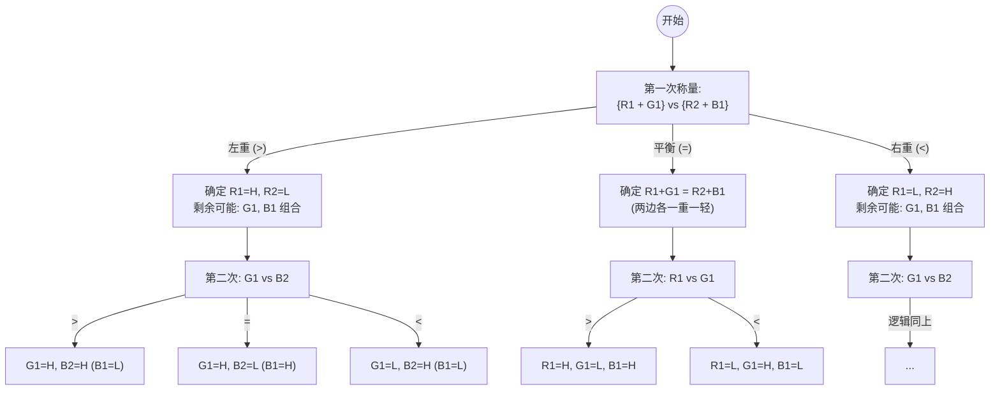
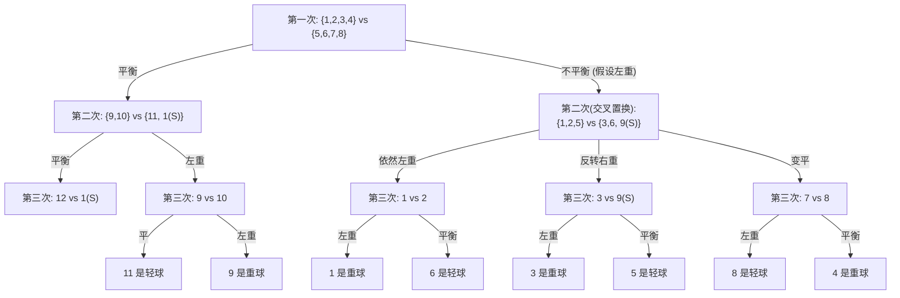

# 第二章 论证的分析

## 2.1-2.4论证的重塑/论证的图示/复杂的论证性语段/推理中的问题

这一整章主要就是做题。分析日常语言中的论述逻辑，复杂且长段的语句可能需要图示来显得更为清晰。（怎么这么感觉像英语阅读题目🤣）

我基本做完了这些练习题，花了很长的时间。这里给出一些题目，以及我个人的分析和Gemini老师的批改。

------

### 逻辑学练习：论证重塑 (Paraphrasing) 汇总笔记

> **学习目标**：剥离修辞干扰，提取核心前提 (Premises) 与结论 (Conclusion)，识别逻辑形式。

------

#### 案例 1：大学教育与写作

原文：

最近毕业的大学生中有成千上万的人无法用书面语言表达自己，这是为什么？因为大学在写作课程的名义下提供给他们的是奇怪的文学理论、马克思主义、女性主义、解构主义和其他怪异的理论。大学欺骗了这些学生。

用户的重塑：

大学教的是奇怪的理论，奇怪的理论没有教大学生如何书面表达自己，所以大学生无法用书面语言表达自己。

**Gemini 的批改：**

- **判定**：找错了结论。
- **核心逻辑**：
  - **P1**：大学生无法表达自己（事实）。
  - **P2**：大学不教写作而教奇怪理论（原因）。
  - **C**：大学**欺骗**了这些学生（价值判断/结论）。
- **要点**：结论通常是作者最想表达的观点（往往是带有情感或道德评价的断言），而不仅仅是因果解释。

------

#### 案例 2：种族多元与福利国家

原文：

种族多元的政府常常比单一种族的政府拥有更低的社会支持，当人们因为种族而被划分的时候，他们就不会觉得是和其他人紧密联系在一起的，也就不太会相信互助程序。要么拥有多样性，要么拥有巨大的福利，想要在同一个政府中享受这两者却很难。

用户的重塑：

种族多元的政府其社会福利低，而种族单一的政府其社会福利高，一个政府要么是种族多元的，要么是种族单一的，所以一个政府不可能同时拥有多样性和高福利。

**Gemini 的批改：**

- **判定**：翻译理解偏差，简化了论证链条。
- **核心逻辑**：
  - **P1**：多元化导致人们缺乏紧密联系感和互信（社会支持度低）。
  - **P2**（隐含前提）：高福利系统依赖于高互信和社会支持。
  - **C**：多样性与大福利难以共存。
- **要点**：原文的 "Social Support" 是指人际互信，而非福利金。重塑应保留“为什么”难以共存的因果链条。

------

#### 案例 3：自由与人类历史（否定后件式）

原文：

奥兰多·帕特森认为：“自由是人类处境的一个自然组成部分”，事实却并非如此。如果奥兰多的观点是正确的，我们就有望发现遍布于整个人类历史的自由社会。但我们没有找到，反而，我们发现的是自古以来形色各样的专制政府。

用户的重塑：

如果自由是人类处境的一个自然组成部分，那么我们就有望发现遍布于整个人类历史的自由社会。但是我们没有找到，反而，我们发现的是自古以来形色各样的专制政府，所以自由不是人类处境的一个自然组成部分。

**Gemini 的批改：**

- **判定**：重塑满分，逻辑命名错误。
- **逻辑形式**：**否定后件式 (Modus Tollens)**。
  - 如果 $P$ 则 $Q$；非 $Q$；所以非 $P$。
- **要点**：否定“如果”后面的部分叫否定前件，否定“那么”后面的部分叫否定后件。这是一个有效的论证。

------

#### 案例 4：未来信号论证

原文：

显然，未来科学家永远无法在时间中回溯地发送信号。试想，如果他们能这么做到的话，我们现在不是应该已经接收到他们的信息了吗？

用户的重塑：

如果科学家能够向过去发送信号，那么我们能够收到未来科学家的信息。但是我们没有收到，所以科学家不能向过去发送信号。

**Gemini 的批改：**

- **判定**：完全正确。
- **逻辑形式**：**否定后件式 (Modus Tollens)**。
- **要点**：成功实现了“去修辞化”，将反问句转化为逻辑上的否定前提（$\neg Q$）。

------

#### 案例 5：捕鲸行为的类比

原文：

（克里斯托夫将因纽特人捕鲸与日、挪、冰等国捕鲸等同视之）……因纽特人所面临的恶劣生存环境决定了他们的日常饮食……日本以及欧洲捕鲸国家的人们可以选择所摄取的食物……

用户的重塑：

因纽特人因为生存需要不得不捕杀鲸鱼，日本人等捕杀鲸鱼却没有充足的理由，所以这两种捕杀鲸鱼的行为有本质区别，不能等同视之。

**Gemini 的批改：**

- **判定**：完全正确，捕捉到了“靶子”观点。
- **核心逻辑**：**反驳类比 (Refuting an Analogy)**。
  - 区分了“生存必然性 (Necessity)”与“选择自由 (Choice)”。
- **要点**：识别出作者是通过指出“关键属性（是否可选）”的不同来否定原有的类比。

------

#### 案例 6：无限宇宙与他者

原文：

太空中所包含的原子是不可数的，促使它们散向各处的力……也是不可数的。所以我们必须认识到在宇宙的某处存在另外的世界，那里有不同的人类和动物。

用户的重塑：

原子是不可数的，驱使他们散向各处的力也是不可数的，所以原子无处不在，我们这里有原子（组成人类和动物），所以在其他的地方也会有原子（组成人类和动物）。

**Gemini 的批改：**

- **判定**：抓住了直觉，补全了隐含前提。
- **核心逻辑**：**归纳/类比论证**（基于概率的平庸原理）。
  - **P**：构成生命所需的原材料和力量在宇宙中是无限且均匀分布的。
  - **C**：相同的结果（生命/世界）必然在其他地方出现。

------

#### 案例 7：种族问题的僵局

原文：

我们总是被民族和种族问题困扰。但是面临这些问题的时候我们往往闭目塞听……摆出置身事外的架势。这样，错误的总是对方。

用户的重塑：

面临种族问题的时候，各个种族往往都闭目塞听，置身事外。这样，错误的总是对方。而自身没有改变。所有种族都没改变，所以我们会一直被民族和种族问题困扰。

**Gemini 的批改：**

- **判定**：基本正确，补全了“因果循环”逻辑。
- **核心逻辑**：**僵局论证/恶性循环解释**。
  - 前提是各方的心理态度（闭目塞听/互推责任），结论是现象的持续性。

------

**学习笔记总结：**

1. **去修辞化**：把反问、感叹转为陈述。
2. **找准结论**：结论是作者最想让你接受的那个断言。
3. **区分真理与有效性**：重塑只看逻辑结构是否紧密。
4. **注意指示词**：因为/所以（由于/因此）是重塑的生命线。

### 逻辑学练习：论证图示笔记

#### 🛠 符号说明

- **$A \rightarrow B$**：命题 A 是命题 B 的前提（支撑关系）。
- **$\{A + B\} \rightarrow C$**：协同支持（Linked），A 与 B 必须结合才能推导出 C。
- **$A \rightarrow C; B \rightarrow C$**：独立支持（Convergent），A 和 B 分别独立支持 C。
- **$A \rightarrow B \rightarrow C$**：串行论证（Serial），B 既是 A 的结论，又是 C 的前提。

------

一、 串行论证 (Serial Argument)

这类论证的特点是环环相扣，逻辑呈线性递进。

#### 1. 伊斯兰提镇区图书馆过滤程序

- **原文**：无论如何，①【图书馆计算机上必须拥有过滤程序】。②【色情作品在任何层面都是社会的灾难】。③【我们的公共图书馆绝不能被用来传送这些污秽的东西】。
- **你的解法**：$2 \rightarrow 3 \rightarrow 1$
- **Gemini 批改**：**正确**。从普遍社会判断 (2) 到特定场所原则 (3)，再到具体执行手段 (1)。

#### 2. 婚姻的社会责任

- **原文**：①【已婚者比独身者各方面更健康稳定】。因此 ②【婚姻是一种负责任的社会行为】。③【在税收法规里必须贯彻支持婚姻的原则】。
- **你的解法**：$1 \rightarrow 2 \rightarrow 3$
- **Gemini 批改**：**正确**。事实证据 (1) $\rightarrow$ 性质判定 (2) $\rightarrow$ 政策建议 (3)。

#### 3. 欧元与英国领导力

- **原文**：①【提议采用欧元】。②【我们是欧洲的一部分，深受影响】。因此 ③【为了使欧洲向期望方向转变，我们应该执行领导力】。
- **你的解法**：$2 \rightarrow 3 \rightarrow 1$
- **Gemini 批改**：**正确**。事实背景 (2) $\rightarrow$ 战略必要性 (3) $\rightarrow$ 具体操作方案 (1)。

#### 4. 日本捕鲸与经济学

- **原文**：①【捕鲸消失与动物高贵无关，与经济学原理有关】。②【调查显示极少数人吃鲸鱼肉】。③【不愿吃就不愿买】。④【不买则日本将告别捕鲸业】。
- **你的解法**：$2 \rightarrow 3 \rightarrow 4 \rightarrow 1$
- **Gemini 批改**：**正确**。消费心理 (2) $\rightarrow$ 市场行为 (3) $\rightarrow$ 产业结果 (4) $\rightarrow$ 归纳结论 (1)。

------

二、 独立/收敛论证 (Convergent Argument)

这类论证提供多个互不依赖的理由来支持同一个结论。

#### 5. 林登·约翰逊总统评价

- **原文**：①【约翰逊是最杰出的总统之一】。②【为民族正义做出贡献】。③【为社会保障做出贡献】。④【最富抱负的思想家】。（以及其他功绩）
- **你的解法**：$\{2+3+4\} \rightarrow 1$
- **Gemini 批改**：**建议修改为独立支持**。$2 \rightarrow 1; 3 \rightarrow 1; 4 \rightarrow 1$。因为每一项功绩都足以单独支撑其“杰出”的评价。

#### 6. 谴责贫富差距的理由

- **原文**：①【要谴责贫富差距】。②【导致政治不稳定】。③【与犯罪相关】。④【与寿命缩短相关】。⑤【不公正/无道德证明】。
- **你的解法**：$\{2+3+4+5\} \rightarrow 1$
- **Gemini 批改**：**建议修改为独立支持**。$2 \rightarrow 1; 3 \rightarrow 1; 4 \rightarrow 1; 5 \rightarrow 1$。这是典型的从多个维度（政治、治安、生理、道德）独立堆叠证据。

#### 7. 战争与问题 (反驳型)

- **原文**：①【战争创造问题但不解决问题】。②【二战解决了纳粹问题】。③【美国革命解决了税权问题】...（更多战争实例）
- **你的解法**：$2 \rightarrow 1; 3 \rightarrow 1; 4 \rightarrow 1; 5 \rightarrow 1$
- **Gemini 批改**：**结构识别正确，性质为“反驳”**。②③④⑤ 是作为 ① 的反面证据（证伪），且每个例子都独立具备证伪能力。

------

三、 协同论证 (Linked Argument)

前提之间必须相互结合，才能产生推导效力。

#### 8. 加利福尼亚“三振出局”法

- **原文**：①【加州监狱人数激增】。②【纽约州人数几乎没增】。③【纽约暴力犯罪下降更多】。④【犯罪率下降不能归功于严苛法律】。
- **你的解法**：$\{1+2+3\} \rightarrow 4$
- **Gemini 批改**：**完全正确**。只有通过加州与纽约的“投入与产出”对比，才能否定严苛法律的作用。

#### 9. 蛋白质专利争议

- **原文**：①【蛋白质是被发现而非发明】。②【发明可专利，发现不可】。③【蛋白质专利有问题】。
- **你的解法**：$\{1+2\} \rightarrow 3$
- **Gemini 批改**：**完全正确**。典型的三段论：事实 (1) + 规则 (2) $\rightarrow$ 结论 (3)。

#### 10. 克利夫兰竞选忠告

- **原文**：①【克利夫兰公共记录好/私生活差】。②【对手私生活好/公共记录差】。③【应按擅长领域选人】。④【让克利夫兰留任公共领域】。
- **你的解法**：$\{1+2+3\} \rightarrow 4$
- **Gemini 批改**：**完全正确**。对比事实 (1, 2) 必须结合择优原则 (3) 才能得出具体人选建议 (4)。

------

四、 复合/混合结构 (Complex Structures)

#### 11. 加尔布雷斯的社会观察

- **原文**：①【个人富有而社会贫穷】。②【人愿买家用吸尘器】 $\rightarrow$ ④【房子清洁】。③【街道吸尘器被视为不必要】 $\rightarrow$ ⑤【街道不干净】。
- **你的解法**：$2 \rightarrow 4; 3 \rightarrow 5; \{4+5\} \rightarrow 1$
- **Gemini 批改**：**非常精准**。识别出了平行路径的推导，以及最终结论 1 是基于 4 和 5 的对比（协同）得出的。

#### 12. 马基雅维利《君主论》

- **原文**：①【被畏惧更安全】。②【人性卑劣】 $\rightarrow$ ⑥【友谊易碎】。再加上 ③【利益买来的友谊不靠谱】，共同得出 ④【相信承诺很危险】。此外 ⑤【畏惧产生顾虑】。
- **你的解法**：$2 \rightarrow 6; \{6+3\} \rightarrow 4; 4 \rightarrow 1; 5 \rightarrow 1$
- **Gemini 批改**：**出色**。捕捉到了底层因果 (2-6)、协同支持 (6+3-4) 以及最终的收敛支持 (4-1, 5-1)。

------

而后面关于推理中的问题，题目大多是精心设计的智力问题，我感觉只是为了好玩，日常生活当中不会出现这样的问题，或许就只有考试会出现。所以这并不会做脱离实际的题目，但是有几道题可以看一下。

### 称重问题

你面前有六个球：两个红球、两个绿球和两个蓝球。在每一对同色球中，你知道其中一个比另一个重。你还知道所有三个重球的重量相同，所有三个轻球也一样重。另外，这六个球（把它们分别叫作R1、R2、G1、G2、B1和B2）难以区分。你只有一架天平秤盘。如果天平两边放相同的重量，它将保持平衡；如果两边的重量不相等，则重的那边会下沉。若在秤盘上称量不能超过两次，如何能辨认出所有三对球中的重球和轻球？
    

有12个金属球，其大小、颜色等外观完全相同。事实上，它们当中的11个完全相同，但有一个是“特别”的：它与其他球仅在重量上有区别，它比其他球或重或轻。有一架天平台秤，可以称量金属球的重量。如果天平两边都放上相同数目的球，并且“特别”的球在其中一边，如果它较重的话，那一边将下沉，如果它较轻的话，那一边将上升；如果“特别”的球不在被称量之列并且两边球的数目相同的话，天平就平衡。只允许你称量三次，减少或增加一个球就构成一次独立的称量过程。

对你的挑战是：设计一套称量三次的方案，无论“特别”的球与其他球怎么混合，该方案都能使你将它辨别出来，并且能使你判定该球究竟比其他球重还是轻。

